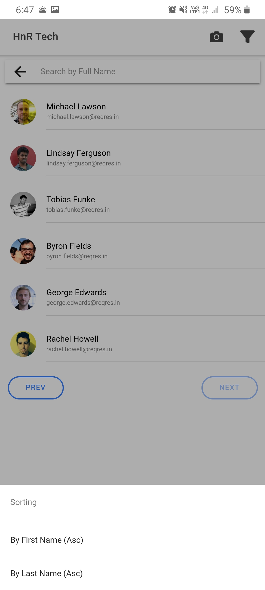

# HNR TECH TEST PROJECT

Test project given by HNR TECH as a Technical Round Selection.

● Create a page where the user's picture, name, and email will be visible in the list.

● On click of the user, it should redirect to the profile page.

● Only 6 records should be shown on each page and the navigate link will be used to go to the next
and previous page.

● There should be a search bar to search the user and sorting button to sort records by full name on
the header.

● API https://reqres.in/api/users

# Screenshots

### App Icon

### Splash Screen

### User List 1

### User List 2

### User Profile

### Camera Capture

### Captured Clear

### Sorting

### Sorted

### Searching

### Vibration 

### Prerequisites

Angular
Ionic
Cordova

Ionic:

   Ionic CLI                     : 6.10.0 (C:\Users\Fauzi\AppData\Roaming\npm\node_modules\@ionic\cli)
   Ionic Framework               : @ionic/angular 5.2.2
   @angular-devkit/build-angular : 0.901.9
   @angular-devkit/schematics    : 9.1.9
   @angular/cli                  : 9.1.9
   @ionic/angular-toolkit        : 2.2.0

Capacitor:

   Capacitor CLI   : 2.2.0
   @capacitor/core : 2.2.0

Cordova:

   Cordova CLI       : 9.0.0 (cordova-lib@9.0.1)
   Cordova Platforms : android 8.1.0
   Cordova Plugins   : cordova-plugin-ionic-keyboard 2.2.0, cordova-plugin-ionic-webview 4.2.1, (and 8 other plugins)

Utility:

   cordova-res : 0.15.1
   native-run  : not installed

System:

   NodeJS : v12.18.0 (C:\Program Files\nodejs\node.exe)
   npm    : 6.14.4
   OS     : Windows 7